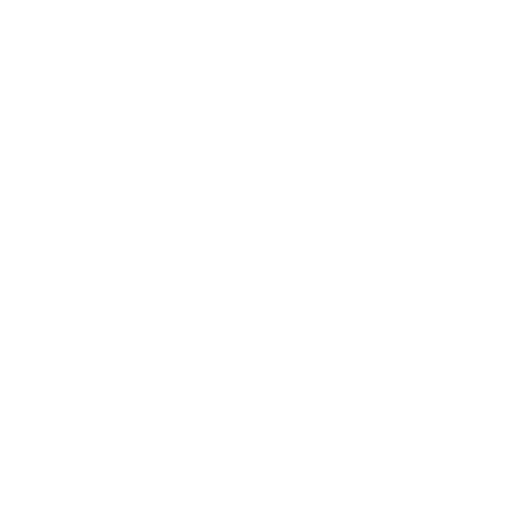

## About Me

**Computer Science Major | AI Development Enthusiast** | **Florida Polytechnic · Computer Science**

Hey there! I’m currently pursuing my degree in **Computer Science** with a concentration in **Artificial Intelligence Development**.  
I’m passionate about building smart, efficient systems and exploring how AI can solve real-world problems.  
I love working on projects that combine **programming**, **data**, and **automation** and I’m always learning new tools to expand my stack.

How to reach me: linaresn2024@gmail.com

## 🛠️ Tech Stack

  
  
  
  
  

<!---
NatashaL2191/NatashaL2191 is a ✨ special ✨ repository because its `README.md` (this file) appears on your GitHub profile.
You can click the Preview link to take a look at your changes.
--->
